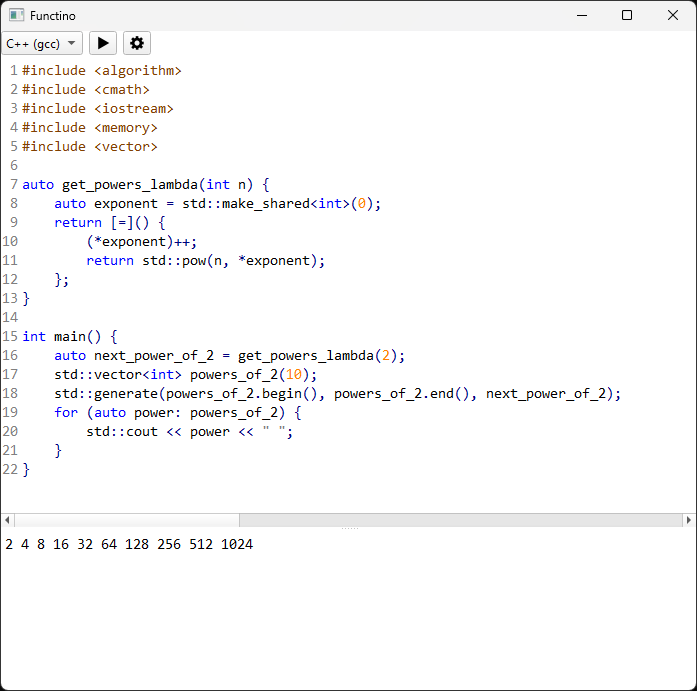

# Functino

Functino is a simple graphical code editor and runner for throwaway code. Its functionality is somewhere in between a [REPL][repl-definition] and a fully-featured text editor. With Functino, you simply type code in the editor panel, press the run button, and the output of the code is shown in the output panel. Several languages are supported with no configuration needed to use them. If you've ever found yourself wanting to mess around with a block of code and thought "a REPL would be a bit unwieldy but my normal development environment would be overkill for this," then Functino might be for you!

 

### Features

* Simple interface.
* Cross-platform.
* Built-in support for several languages:
    * C and C++ (via gcc)
    * NodeJS
    * Python
    * Rust
* No configuration needed to use existing compilers/interpreters installed on your system.
* Ability to configure support for languages and toolchains not already built in.
* Syntax highlighting.
* Light and dark theme that adjusts based on your system theme.

### Installation

1. Make sure [python is installed][python-install].

2. Install Functino from [PyPI][pypi-site]:

```bash
pip install functino
```

### Configuring Support for New Languages/Toolchains

If you would like to use a language or toolchain that Functino currently doesn't support, you can configure Functino to use it! The following is a [TOML][toml-site] file that tells Functino how to execute Python code, with comments explaining each field:

```toml
# This is the display name for this profile. Display names must be unique across all
# profiles.
name = "Python"

# This is the language ID for this profile. Language IDs must match with a match-case
# key in src/functino/gui/language.py in order for the editor to provide syntax
# highlighting.
language_id = "python"

# This is the file extension that source files of this language use. Some compilers/
# interpreters rely on the file extention to be correct.
source_file_extension = "py"

# This option tells Functino whether or not this profile requires a separate compilation
# step. The value of this option will have an influence on the proper format of the
# command option below.
compile = false

# The section below tell Functino what command to run to handle the the source file. If
# compile is false, this will be an interpret command. If compile is true, this will be
# a compilation command, and the resulting program produced by the compilation will be
# run separately.
#
# All profile commands must have one option that is exactly equal to
# "{source_file_path}". Functino will replace this with the internally-used temporary
# file that contains the source code to run. File extensions or prefixes must not be
# added to this option.
#
# Profile commands for compiled languages must additionally have one option that is
# exactly equal to "{executable_path}". Functino will replace this with an
# internally-used temporary file that is meant to be used by the compiler to put the
# compiled program into. File extensions or prefixes must not be added to this option.
[command]

# The default command is the command that will be used if there's no specific command
# for the current operating system we're running in.
default = ["python", "{source_file_path}"]

# If you need to specify a different command for a particular operating system, then the
# key for the command must match up with one of the possible outputs of
# https://docs.python.org/3/library/platform.html#platform.system.
#
# In this case, we need a special command on windows to prevent the console window from
# popping up.
Windows = ["pythonw", "{source_file_path}"]
```

You can place your custom language profiles in one of the following directories (based on your operating system), and Functino will automatically load them:

* Linux: `~/.config/functinodev/functino`
* Mac: `~/Library/Preferences/functinodev/functino`
* Windows: `C:/Users/<USER>/AppData/Local/functinodev/functino`

### Known Issues

* Currently there is no syntax highlighting support for Rust.

### Development Setup

1. Make sure [python is installed][python-install].

2. Get project source.

```bash
git clone https://github.com/davidscholberg/functino.git
cd functino
```

3. Create and enter [python virtual environment][python-venv].

```bash
python -m venv .venv
source .venv/bin/activate
```

4. Build and install the project package as an [editable install][editable-install] with dev dependencies.

```bash
pip install --editable .[dev]
```

5. Install the commit hooks to perform formatting and linting on commit (`pre-commit` is installed locally as a dev dependency).

```bash
pre-commit install
```

### Credits

Functino is written in [Python][python-site] and uses [PyQt6][pyqt6-site] for all GUI functionality. Text editing and syntax highlighting functionality is provided by [QScintilla][qscintilla-site], and the syntax highlighting color themes are provided by [Notepad++][notepadpp-site] theme files.

[editable-install]: https://setuptools.pypa.io/en/latest/userguide/development_mode.html
[notepadpp-site]: https://notepad-plus-plus.org/
[pypi-site]: https://pypi.org/
[pyqt6-site]: https://riverbankcomputing.com/software/pyqt
[python-install]: https://wiki.python.org/moin/BeginnersGuide/Download
[python-site]: https://www.python.org/
[python-venv]: https://docs.python.org/3/library/venv.html
[qscintilla-site]: https://riverbankcomputing.com/software/qscintilla/intro
[repl-definition]: https://en.wikipedia.org/wiki/Read%E2%80%93eval%E2%80%93print_loop
[toml-site]: https://toml.io/en/